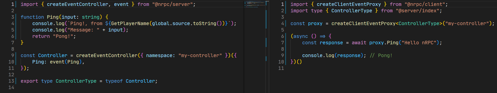
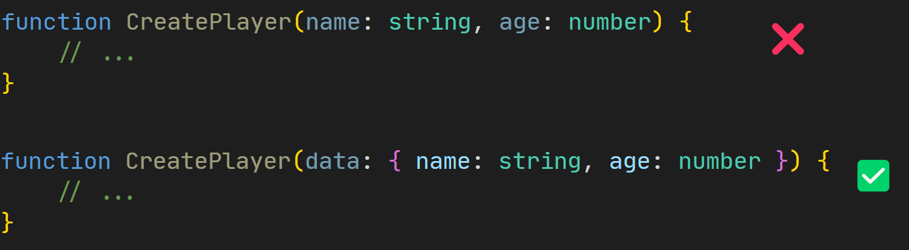
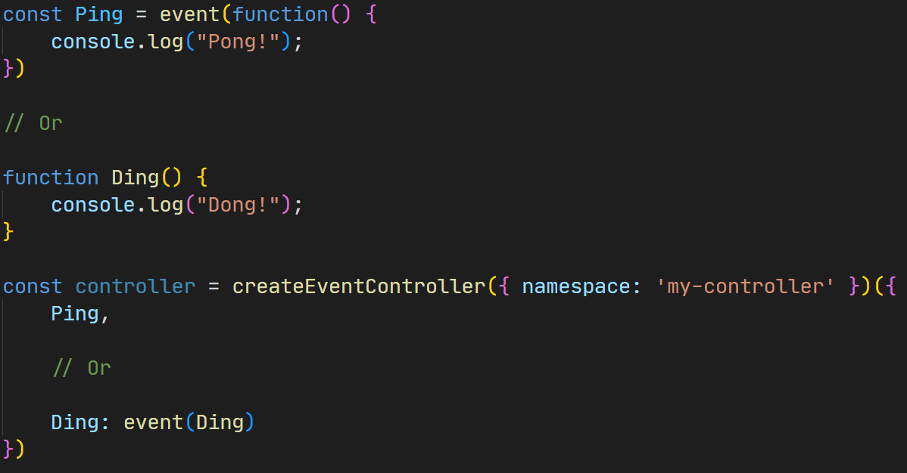

<div align="center">
  <h1>Native RPC (nRPC)</h1>
  <h3>tRPC insipired server-client callback library for the CitizenFX platform</h3>
  <figure>
    
    <figcaption>
      <p align="center">
        The <strong>only</strong> thing needed to imported from the server / client is the their respective controller type<br>Changing the input type in the function also changes the function on the other end
      </p>
    </figcaption>
  </figure>
</div>


## Calling functions on the client from the server

`client.ts`
```ts
import { createEventController, event } from "@nrpc/client";

function Ping() {
	return "Pong!"
}

const controller = createEventController({ namespace: "<name_space_name>" })({
	Ping: event(Ping)
});

export type ClientController = typeof controller;

```

`server.ts`
```ts
import { createServerEventProxy } from "@nrpc/server";
import type { ClientController } from "./client";

const proxy = createServerEventProxy<ClientController>("<name_space_name>");

console.log(await proxy.Ping(playerSrc)()) // Pong!
```

## Calling functions on the server from the client

`server.ts`
```ts
import { createEventController, event } from "@nrpc/server";

function Ping() {
	return "Pong!"
}

const controller = createEventController({ namespace: "<name_space_name>" })({
	Ping: event(Ping)
});

export type ServerController = typeof controller;

```

`client.ts`
```ts
import { createClientEventProxy } from "@nrpc/server";
import type { ServerController } from "./server";

const proxy = createServerEventProxy<ClientController>("<name_space_name>");

console.log(await proxy.Ping()) // Pong!
```


## Caveats
- Functions can only have one parameter, so if more is needed then a object should do the trick <br> 

- The <code>any</code> type can't be used as the parameter type, because of the way zero-parameter callbacks works

- The functions needs to be wrapped in the <code>event()</code> function <br> 

## Contributing
Any contributions are happily welcomed. This package was made with my small amount of TypeScript typing knowledge that i had at the time and any help with either trimming down the list of caveats or improvements to the source code is gladly accepted